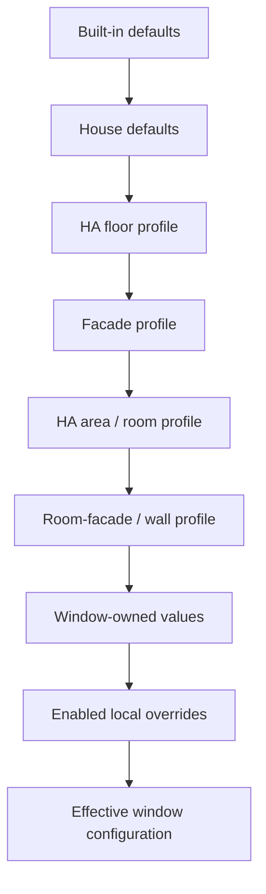

# Solar Shading Calculation Flow

This document describes the implemented data flow. Percent values are always
Home Assistant open positions: `100%` is open and `0%` is closed.

## Configuration Inheritance



The merge order is deterministic:

```text
effective = built_in
          + house
          + floor
          + facade
          + room
          + room_facade
          + window_owned
          + enabled_window_overrides
```

`configuration_layers` and `configuration_sources` on every position sensor
show which layers were applied and which layer supplied each effective value.

Facade orientation is derived as:

```text
window_azimuth_deg =
  (house_reference_azimuth
   + facade_offset
   + window_facade_correction) mod 360
```

## Calculation Diagram

```mermaid
flowchart TD
  Config[Effective configuration] --> SolarGeometry
  Sun[Sun azimuth and elevation] --> SolarGeometry

  subgraph SolarGeometry[1. Solar geometry]
    Gamma[gamma = wrap(window azimuth - sun azimuth)]
    LocalAngle[window angle = clamp(90 - gamma, 0, 180)]
    FOV[field of view left/right and min/max elevation]
  end

  SolarGeometry --> HorizonMode{Horizon mode}
  HorizonMode -->|window| LocalHorizon[interpolate profile at window angle]
  HorizonMode -->|compass| CompassHorizon[cyclic interpolation at sun azimuth]
  LocalHorizon --> VisibleSky
  CompassHorizon --> VisibleSky
  VisibleSky[lower <= sun elevation <= upper] --> DirectGeometry
  FOV --> DirectGeometry

  Config --> Reveals
  SolarGeometry --> Reveals
  subgraph Reveals[2. Reveal self-shading]
    Left[left = clamp(depth left * tan positive gamma / width)]
    Right[right = clamp(depth right * tan negative gamma / width)]
    Top[top = clamp(depth top * tan elevation / height)]
    Combined[shadow = 1 - (1 - max left/right) * (1 - top)]
  end
  Reveals --> Exposure[direct exposure = visible geometry * (1 - shadow)]
  DirectGeometry --> Exposure

  SolarGeometry --> Incidence[cos incidence = clamp(cos elevation * cos gamma, 0, 1)]
  Config --> Glass[glass preset: base solar transmission and reflection]
  Incidence --> Glass
  Glass --> Optical[angle-adjusted reflection and transmission]
  Exposure --> Gain
  Incidence --> Gain
  Optical --> Gain
  Gain[solar gain = exposure * cos incidence * solar transmission]

  OpenMeteo[Open-Meteo direct irradiance or local irradiance sensor, W/m2] --> Radiation
  Config --> Radiation
  Radiation[irradiance factor = clamp(current irradiance / strong-sun reference)] --> EffectiveGain
  Gain --> EffectiveGain[effective gain = solar gain * irradiance factor]
  Gain --> Power[transmitted solar power W/m2 = current irradiance * solar gain]
  Power --> WindowPower[window watts = W/m2 * width * height]

  Forecast[Today maximum temperature and preemptive start time] --> TemperatureGate
  Tomorrow[Tomorrow maximum temperature: strengthening only] --> Response
  RoomTemp[Measured room temperature] --> TemperatureGate
  CurrentTemp[Current outside temperature] --> TemperatureGate
  Config --> TemperatureGate
  TemperatureGate[Cold lockout AND today hot forecast OR room threshold] --> ControlMode
  EffectiveGain --> ControlMode{3. Heat-protection mode}
  Power --> ControlMode

  ControlMode -->|binary| Binary[If transmitted W/m2 >= binary threshold, target = fixed binary open position]
  ControlMode -->|scaling| Response[response = nonlinear function of forecast-adjusted effective gain]
  Response --> Score[weighted risk from exposure, incidence, glazing, irradiance and forecast]
  Config --> Score
  Score --> Preset[apply preset, room daylight context and away adjustments]
  Preset --> Thresholds[interpolate between partial and strict expert thresholds/targets]

  Binary --> Targets
  Thresholds --> Targets
  Power --> WattCap[optional continuous power cap: max open = limit / transmitted power * 100]
  WattCap --> Targets

  Config --> Night{4. Night mode}
  Sun --> Night
  Clock[Local time] --> Night
  Night -->|fixed times active| NightPosition[night position]
  Night -->|solar night active| NightPosition
  Night -->|day| DayPosition[min day fallback and automatic targets]
  Targets --> DayPosition

  NightPosition --> Limits
  DayPosition --> Limits[5. Window min/max compatibility limits]
  Limits --> Mapping[optional cover output interpolation and inversion]
  Mapping --> Manual[manual override and command interval/delta checks]
  Manual --> Output[final cover command and position sensor]
```

## Physical Threshold Meanings

| Setting | Physical meaning | When crossed |
| --- | --- | --- |
| `solar_radiation_reference_w_m2` | Incoming direct irradiance before window geometry and glazing that counts as strong sun. | It normalizes irradiance for the scaling model; it is not itself a close command. |
| `binary_close_threshold_w_m2` | Estimated direct solar power transmitted through one square meter of glazing after orientation, horizon, reveals, reflection and transmission. | Binary mode commands `binary_close_position`. |
| `max_transmitted_solar_power_w_m2` | Maximum desired transmitted solar power per square meter of glazing. | The continuous cap reduces the maximum open position approximately by `limit / current power`. |
| `room_heat_protection_threshold` | Measured room temperature where reactive heat protection may start immediately. | Opens the common activation gate independently of today's forecast. |
| `forecast_hot_day_threshold` | Today's forecast maximum outside temperature where heat protection may start. | Opens the common activation gate after the preemptive start time. |
| `forecast_very_hot_day_threshold` | Forecast temperature where additional pressure saturates. | Raises the scaling pressure; it no longer selects a separate fixed position. |
| `heat_protection_min_outside_temp` | Measured outside-temperature cold lockout. | Below it, heat protection remains disabled even on a forecast hot day. |

## Diagnostic Output

The sensor exposes `decision_reason` and an ordered `decision_trace`. The trace
contains the night, azimuth, horizon, direct-exposure, outside-temperature and
transmitted-power gates followed by the selected target.

## Future Thermal Phase Shift

Wall and roof phase shift is intentionally not mixed into window optics. The
future thermal model belongs to the room-facade/wall layer and will add a
delayed thermal-pressure signal between `Power` and `ControlMode`:

```text
delayed_wall_pressure(t) =
  transmitted_or_incident_power(t - phase_shift_hours)
  * amplitude_damping_factor
  * wall_or_roof_area_factor
```

Likely inputs are U-value, phase shift in hours, temperature-amplitude damping,
construction area/type and whether the element is a wall or roof. The current
profile hierarchy can add these values without duplicating them on every
window.
