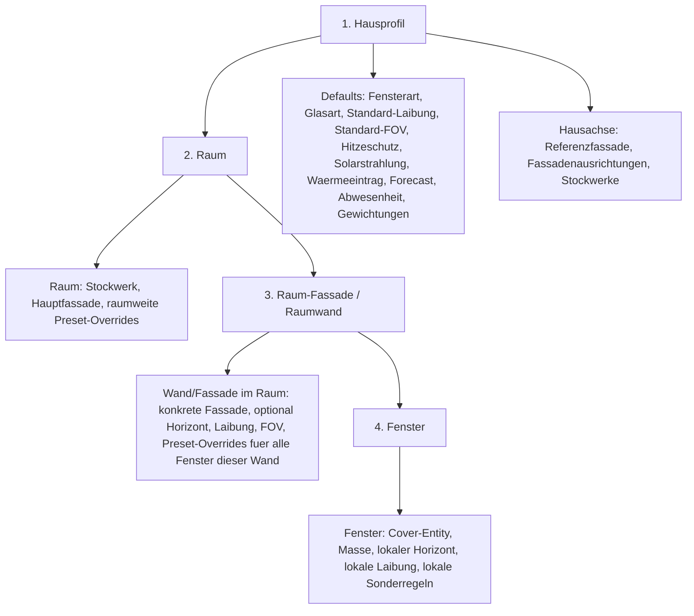

# Solar Shading Settings Flow Audit

This document maps the current settings to the active calculations and marks
settings that should be hidden, renamed, merged, or removed.

## Key semantic fixes

## Weather and forecast decision

Product decision:

```text
Solarwirkung wird nicht mehr aus Wetterzustand, Wolkendeckung,
Niederschlag, Regenwahrscheinlichkeit oder UV-Index abgeleitet.
```

Normal heat-protection inputs should be:

```text
1. Gemessene Solarstrahlung in W/m2, if a local sensor exists.
2. Open-Meteo/OpenSolar solar radiation in W/m2, as the normal default.
3. Temperature forecast for today/tomorrow.
```

The Home Assistant `weather` entity may still be useful as a data source for
daily maximum temperatures, but its condition/cloud/rain fields should no
longer drive solar gain. Current rain or cloud state is irrelevant once real
solar radiation is available.

Implemented in `0.3.0b41`:

```text
weather_factor, forecast_cloud_damping, forecast_precipitation_*_damping,
forecast_uv_risk, Lux and their weights are removed from the active policy.
```

If no measured/open solar radiation is available, the UI should make that
explicit instead of silently falling back to weather condition proxies.

## Control mode decision

The heat-protection policy should support two understandable control modes:

```text
1. Skalierend
   The current behaviour: solar/heat strength is converted into a continuous
   target. More heat means gradually less open position.

2. Binaer
   If the configured heat condition is exceeded, move to one configured
   target position. If it is not exceeded, do not apply the heat-protection
   target.
```

This is especially relevant for transparent covers. The current
`transparent_blind` setting is a hard-coded legacy climate shortcut:

```text
if summer and transparent_blind:
    target = 0% open
```

Better target model:

```text
Cover-Wirkung:
- Verdunkelnd / stark verschattend
- Transparent / lichtdurchlaessig

Hitzeschutz-Regelart:
- Skalierend nach Sonnen-/Waermestaerke
- Binaer ab Schwelle

Binaeres Ziel:
- Bei Schwelle ueberschritten auf X% offen fahren
```

For example:

```text
Transparentes Cover, binaer:
Ab Max. Waermeeintrag durch Glas > 180 W/m2 -> 20% offen

Raffstore, skalierend:
Zwischen Start- und Stark-Schwelle gleitend von 70% offen zu 30% offen
```

This would make `hot_day_close_*` and `transparent_blind` part of the same
concept instead of separate special cases.

### `solar_radiation_reference_w_m2`

Current meaning:

```text
solar_radiation_factor = clamp(current_solar_radiation_w_m2 / reference_w_m2, 0, 1)
```

This is **not** a maximum allowed heat gain. It is a calibration point for
incoming solar radiation before the glass/geometry model.

Better UI name:

```text
Schwelle fuer starke Sonneneinstrahlung
```

Better help text:

```text
Einfallende Solarstrahlung in W/m2, ab der die Sonne als volle Sonnenlast
zaehlt. Niedrigere Werte lassen den Hitzeschutz frueher reagieren, hoehere
Werte spaeter. Dieser Wert beschreibt die Strahlung vor dem Glas, nicht den
bereits in den Raum eingetragenen Waermestrom.
```

When this threshold is reached, nothing directly "locks" the cover. The solar
radiation component simply saturates at 1.0 and cannot increase the policy
pressure further.

### `max_transmitted_solar_power_w_m2`

Current meaning:

```text
transmitted_solar_power_w_m2 = solar_radiation_value_w_m2 * solar_gain_factor
```

If enabled and temperature-gated:

```text
if transmitted_solar_power_w_m2 > max_transmitted_solar_power_w_m2:
    limited_open_position = round(max_transmitted_solar_power_w_m2 / transmitted_solar_power_w_m2 * 100)
```

This is actually a W/m2 glass-area limit, not plain watts.

Better UI name:

```text
Max. Waermeeintrag durch Glas
```

Without a measured or Open-Meteo radiation value, transmitted solar power is
unknown and no weather-based replacement value is fabricated.

What happens when it is exceeded:

```text
final_open_position = min(base_position, policy_target_position, heat_power_limited_open_position)
```

This does **not** physically prevent manual opening. If manual override tracking
is active, a manual position change can pause automation until the override
duration expires. After that, automation may send the limited target again.

## Active Calculation Flow

```mermaid
flowchart TD
  Sun["sun.sun: solar azimuth, elevation"] --> Rel["gamma = ((window_azimuth - sun_azimuth + 180) % 360) - 180"]
  WinAz["set_azimuth / Fenster-Azimut"] --> Rel
  Rel --> Local["local_window_angle = clamp(90 - gamma, 0, 180)"]

  Fov["fov_left, fov_right"] --> Valid
  Elev["min_elevation, max_elevation"] --> Valid
  Rel --> Valid["valid = gamma < min(fov_left,90) and gamma > -min(fov_right,90) and elevation valid"]

  Horizon["horizon_profile"] --> HInterp["interpolate lower/upper horizon at local_window_angle"]
  Local --> HInterp
  HInterp --> HGate["sun_within_horizon = lower <= sun_elevation <= upper"]

  BlindSpot["blind_spot, blind_spot_left/right/elevation"] --> DirectSun
  Sunset["sunset_offset, sunrise_offset"] --> DirectSun
  Valid --> DirectSun["direct_sun_valid = valid and horizon and not sunset and not blind_spot"]
  HGate --> DirectSun

  Width["window_width"] --> Reveals
  RevL["reveal_left_depth"] --> Reveals
  RevR["reveal_right_depth"] --> Reveals
  RevT["reveal_top_depth"] --> Reveals
  Rel --> Reveals["side/top reveal shadow fractions"]
  Height["window_height"] --> Reveals
  Reveals --> Exposure["direct_solar_exposure = horizon ? 1 - combined_shadow : 0"]

  Glass["glass_type"] --> Optics["glass coefficients"]
  Rel --> Incidence["incidence_angle = acos(cos(elevation)*cos(gamma))"]
  Sun --> Incidence
  Incidence --> IncCos["incidence_cosine = clamp(cos(incidence_angle),0,1)"]
  Incidence --> Trans["angle-adjusted solar_transmittance"]
  Optics --> Trans

  Exposure --> SolarGain["solar_gain_factor = exposure * incidence_cosine * solar_transmittance"]
  IncCos --> SolarGain
  Trans --> SolarGain

  SolarRadEntity["solar_radiation_entity"] --> RadValue
  OpenMeteo["use_open_data_solar_radiation"] --> RadValue["solar_radiation_value_w_m2"]
  RadValue --> RadFactor["solar_radiation_factor = clamp(value / reference_w_m2,0,1)"]
  RadRef["solar_radiation_reference_w_m2"] --> RadFactor
  RadFactor --> SolarRadiationInput["solar_radiation_factor; no weather/cloud/rain proxy in target model"]

  SolarGain --> EffectiveGain["effective_solar_gain = solar_gain_factor * solar_radiation_factor"]
  SolarRadiationInput --> EffectiveGain

  ForecastTemp["today/tomorrow forecast max temp"] --> TempRisk["temperature_risk = clamp((temp - hot)/(very_hot - hot),0,1)"]
  Hot["forecast_hot_day_threshold"] --> TempRisk
  VeryHot["forecast_very_hot_day_threshold"] --> TempRisk
  Start["forecast_preemptive_start_time"] --> Preemptive["forecast_preemptive_active"]
  TempRisk --> Uplift["forecast_gain_uplift = 1 + strength*radiation_risk + strength*temp_risk"]
  ForecastStrength["forecast_influence_strength"] --> Uplift
  Preemptive --> Uplift
  EffectiveGain --> ForecastGain["forecast_adjusted_gain = effective_solar_gain * forecast_gain_uplift"]
  Uplift --> ForecastGain
  ForecastGain --> Response["heat_gain_response_factor = smoothstep(gain, 0.06..0.32)"]

  Exposure --> Components
  IncCos --> Components
  Trans --> Components
  RadFactor --> Components
  TempRisk --> Components["policy components"]

  Preset["policy_preset"] --> Weights["policy weights unless show_expert_weights"]
  Expert["show_expert_weights + weight_*"] --> Weights
  Components --> Weighted["weighted_score = product(component^(weight/sum_weights))"]
  Weights --> Weighted
  Weighted --> Raw["policy_raw_score = min(weighted_score, heat_gain_response_factor)"]
  Response --> Raw
  Raw --> PresetScore["preset_score = raw * preset_multiplier"]
  Preset --> PresetScore
  Daylight["has_additional_daylight_windows"] --> PresetScore
  PresetScore --> AwayScore["policy_score = away ? preset_score * away_multiplier : preset_score"]
  Away["enable_away_mode, away_entity, away_score_multiplier"] --> AwayScore

  PartialT["partial_close_threshold"] --> Thresholds
  FullT["full_close_threshold"] --> Thresholds
  Preset --> Thresholds["effective thresholds after preset, away, very-hot pressure"]
  Away --> Thresholds
  TempRisk --> Thresholds

  PartialP["partial_close_position"] --> Positions
  FullP["full_close_position"] --> Positions
  Preset --> Positions["effective open-position targets after preset, away, very-hot pressure"]
  Away --> Positions
  TempRisk --> Positions

  Mode["control mode: scaling or binary"] --> PolicyTarget
  AwayScore --> PolicyTarget["policy_target_position(score, thresholds, positions)"]
  Thresholds --> PolicyTarget
  Positions --> PolicyTarget

  HotOverride["hot_day_close_enabled, hot_day_close_threshold, hot_day_close_position, very_hot_day_close_position"] --> HotCap["active_hot_day_close_position"]
  TempRisk --> HotCap
  PolicyTarget --> HeatTarget["heat_gain_target = min(policy_target, hot_day_cap if active)"]
  HotCap --> HeatTarget

  HeatLimit["heat_power_limit_enabled, heat_power_outside_temp_threshold, heat_protection_min_outside_temp, max_transmitted_solar_power_w_m2"] --> HeatCap
  SolarGain --> HeatPower["transmitted_solar_power_w_m2"]
  RadValue --> HeatPower
  EffectiveGain --> HeatPower
  HeatPower --> HeatCap["heat_power_limited_open_position = round(limit / heat_power * 100)"]

  Base["default_percentage or calculated cover geometry"] --> NormalState
  DirectSun --> NormalState["if direct sun: state starts from default/calculated value; else default"]
  HeatTarget --> NormalState["state = min(state, heat_gain_target)"]
  HeatCap --> NormalState["state = min(state, heat_power_limited_open_position)"]
  MinMax["min_position/max_position + enable flags"] --> NormalState
  NormalState --> Climate["optional climate mode may replace normal state"]
  ClimateSettings["temp_entity, temp_low/high, outside_temp, outside_threshold, presence_entity, irradiance threshold, transparent_blind"] --> Climate
  Climate --> Interp["optional interpolation/inverse"]
  InterpSettings["interp, interp_start/end/list, inverse_state"] --> Interp
  Interp --> Automation["delta_position, delta_time, start/end time/entity, manual override settings"]
  Automation --> Service["cover.set_cover_position / set_cover_tilt_position"]
```



## Current Settings And Recommendations

### Keep in normal window geometry

| Setting | Current role | Recommendation |
| --- | --- | --- |
| `set_azimuth` | Compass direction of the window normal. | Keep, but allow facade-derived default. |
| `fov_left`, `fov_right` | Horizontal acceptance angle around window normal. | Keep, but facade/window advanced. |
| `min_elevation`, `max_elevation` | Solar elevation gate. | Advanced geometry. |
| `window_height` | Cover/window height; also area and top reveal. | Keep per window/type. |
| `distance_shaded_area` | Vertical-cover geometry for how far into the room/object shade is calculated. | Rename; currently not obvious. |
| `length_awning`, `angle` | Awning geometry. | Keep only for awning type. |
| `slat_depth`, `slat_distance`, `tilt_mode` | Venetian blind tilt geometry. | Keep only for tilt type. |
| `window_width` | Required for side reveal and area. | Keep geometry. |
| `reveal_left_depth`, `reveal_right_depth`, `reveal_top_depth` | Self-shading by reveal. | Keep geometry. |
| `horizon_profile` | Local 0..180 horizon today. | Add input mode: compass azimuth or window view. |
| `glass_type` | Default optical coefficients. | Move to house profile default, allow local override. |

### Keep but rename / derive from profiles

| Setting | Current role | Recommendation |
| --- | --- | --- |
| `solar_radiation_reference_w_m2` | Calibration for "strong sun" before glass. | Rename to "Schwelle fuer starke Sonneneinstrahlung"; house-profile default. |
| `max_transmitted_solar_power_w_m2` | W/m2 glass power cap. | Keep as "Max. durchgelassene Solarleistung". |
| `forecast_hot_day_threshold` | Forecast temperature where heat protection is allowed. | House profile. |
| `forecast_very_hot_day_threshold` | Temperature where very-hot pressure saturates. | House profile. |
| `forecast_preemptive_start_time` | Earliest time forecast pressure may act. | House profile. |
| `forecast_influence_strength` | Abstract multiplier for forecast uplift. | Replace normal UI with "Forecast reagiert: aus/spaet/moderat/frueh"; expert keeps numeric. |
| `policy_preset` | Bias profile and default weights. | Replace/merge with house Hitzeschutzprofil. |
| `partial_close_threshold`, `full_close_threshold` | Internal score thresholds. | Hide from normal UI; expert only as "Hitzeschutz beginnt" / "Starker Hitzeschutz ab". |
| `partial_close_position`, `full_close_position` | Open-position targets for partial/full heat protection. | Keep as expert or derive from light/medium/strong. |
| `has_additional_daylight_windows` | Makes policy more willing to shade because other daylight exists. | Room/facade-level setting, not per window in normal flow. |
| `enable_away_mode`, `away_entity`, `away_score_multiplier`, `away_threshold_reduction`, `away_position_offset` | Stricter behavior when away. | House profile: one "Bei Abwesenheit strenger verschatten"; expert details hidden. |
| `hot_day_close_enabled`, `hot_day_close_threshold`, `hot_day_close_position`, `very_hot_day_close_position` | Separate hard cap on hot days. | Merge into Hitzeschutzprofil unless expert mode. |
| `heat_power_limit_enabled`, `heat_power_outside_temp_threshold`, `heat_protection_min_outside_temp` | Gate the hard W/m2 cap. | House profile expert; normal UI only shows max heat cap if enabled. |

### Keep as automation controls

| Setting | Current role | Recommendation |
| --- | --- | --- |
| `group` | Controlled cover entities. | Keep. |
| `default_percentage` | Base open position while sun is relevant / default fallback. | Rename to "Normale Offenposition". |
| `sunset_position`, `sunset_offset`, `sunrise_offset` | Night/default timing. | Replace normal UI with simple time-guided "Ruhe-/Nachtposition"; keep sun offsets only as expert mode. |
| `delta_position`, `delta_time` | Avoid frequent small service calls. | Advanced automation. |
| `start_time`, `start_entity`, `end_time`, `end_entity`, `return_sunset` | Active control window. | Automation advanced. |
| `manual_override_duration`, `manual_override_reset`, `manual_threshold`, `manual_ignore_intermediate` | Manual override handling. | Keep advanced. |
| `max_position`, `min_position`, `enable_max_position`, `enable_min_position` | Clamp final position. | Advanced safety/output limits. |
| `inverse_state` | Inverts final position. | Advanced compatibility. |
| `interp`, `interp_start`, `interp_end`, `interp_list`, `interp_list_new` | Remaps final output. | Advanced compatibility, not normal setup. |

### Climate mode controls

| Setting | Current role | Recommendation |
| --- | --- | --- |
| `climate_mode` | Enables legacy climate decision layer. | Consider separating from heat-gain policy. |
| `temp_entity`, `temp_low`, `temp_high` | Winter/summer logic. | Only show in climate mode. |
| `outside_temp`, `outside_threshold` | Summer outside gate. | Rename `outside_threshold` to "Aussentemperatur ab Sommerbetrieb". |
| `presence_entity` | Occupancy branch. | Keep only climate/comfort mode. |
| `weather_state` | Which weather states count as sunny in legacy climate mode. | Retire from heat-gain; keep only if climate mode remains. |
| `lux_entity`, `lux_threshold` | Legacy brightness/glare condition. | Retire from normal setup; keep only legacy climate mode if needed. |
| `irradiance_entity`, `irradiance_threshold` | Legacy irradiance condition. | Climate-mode advanced; avoid confusion with heat-gain solar radiation sensor. |
| `transparent_blind` | Summer closes transparent blind fully in legacy climate mode. | Replace with cover effect + binary/scaling heat-protection mode. |

### Dead, duplicate, or misleading today

| Setting/field | Finding | Recommendation |
| --- | --- | --- |
| `CONF_BLUEPRINT` / `blueprint` strings | Blueprint text exists, but the current config flow does not expose it. README marks blueprint deprecated. | Remove from current setup UI/translations or move to legacy docs. |
| `CONF_HEIGHT_AWNING` | Defined, not used by active code. | Remove. |
| Duplicate `CONF_SUNSET_POS`, `CONF_SUNSET_OFFSET` definitions | Defined twice in `const.py`. | Deduplicate. |
| `weather_factor` / current cloud/rain fallback | Used as fallback when no solar radiation factor exists. | Retire from heat-gain. Use measured/open solar radiation instead. |
| `weight_weather` | Expert weight for the old weather fallback. | Remove from normal and target policy. |
| `use_forecast_cloud_coverage` | Dataclass/property exists, strings exist, but coordinator currently passes `False` unconditionally. | Remove. |
| `use_forecast_precipitation_probability` | Same: hardcoded `False`. | Remove. |
| `use_forecast_precipitation_amount` | Same: hardcoded `False`. | Remove. |
| `use_forecast_uv_index` | Same: hardcoded `False`; `forecast_uv_risk` is not used in active policy. | Remove. |
| `weight_forecast_uv` | Dataclass/string legacy, coordinator passes `0.0`, policy ignores it. | Remove. |
| `weight_forecast_clouds` | Same. | Remove. |
| `weight_forecast_precipitation_probability` | Same. | Remove. |
| `weight_forecast_precipitation_amount` | Same. | Remove. |
| `enable_legacy_basic_shading` | Dataclass/string legacy, coordinator passes `False`, no active branch uses it. | Remove. |
| `heat_power_max_watts` name | It is W/m2, not watts. | Rename with migration alias. |
| `solar_radiation_reference_w_m2` name | Reads like a limit, but is a calibration reference. | Rename label/help text first; maybe config key later. |

## Implemented Setup Model



Current resolver:

```text
effective_config =
  built_in_defaults
  + house_profile
  + floor_profile
  + facade_profile
  + room_profile
  + room_facade_profile
  + window_override
```

Fine-grained settings override coarse settings. The user should normally set
the physics and control rules once on the house, then only assign rooms,
facades, floors, and window geometry. Window-specific settings are for real
exceptions such as local horizon, special reveal geometry, or a different cover
entity.

Current settings ownership:

| Level | Owns | Typical overrides |
| --- | --- | --- |
| House | Rules that should make all windows behave similarly. | Glass default, cover effect, heat-protection preset, solar radiation reference, max transmitted heat, forecast behaviour, away behaviour, expert weights, standard reveal/FOV, house reference axis, facade list, floor list. |
| Room | Group-level setup for all windows in one room. | Home Assistant area/room dropdown, Home Assistant floor dropdown, main facade, room daylight context, room-level stronger/weaker heat protection. |
| Room facade / wall | All windows on one wall of a room. | Concrete facade, horizon profile, reveal/FOV defaults, facade-specific heat-protection override. |
| Window | Physical and automation endpoint details. | Cover entity, exact dimensions, local horizon, local reveal, local azimuth override, compatibility/output limits. |

Room and floor selection decision:

```text
Raeume und Stockwerke sollen nicht als Freitext gepflegt werden.
Die UI soll die bestehende Home-Assistant-Gebaeudestruktur verwenden:

- Raum: Home Assistant Area dropdown
- Stockwerk: Home Assistant Floor dropdown, if available

Nur wenn HA keine Stockwerke liefert, darf ein manueller Fallback angeboten
werden. Ziel ist: keine zweite Raum-/Stockwerksverwaltung in Solar Shading.
```

Recommended wording for reference facade:

```text
Referenzfassade: Die Fassade, an der sich die anderen Fassaden ausrichten.
Gib die Kompassrichtung an, in die die Fenster dieser Fassade schauen.
Andere Fassaden werden als Winkelversatz dazu beschrieben.
```

Example:

```text
Referenzfassade: 12 deg
Fassade Ost: +90 deg -> 102 deg
Fassade Sued: +180 deg -> 192 deg
Fassade West: +270 deg -> 282 deg
```

## Suggested normal UI

Normal setup should only ask:

```text
1. Hausprofil waehlen oder erstellen
2. Fassade / Raumwand / Fenster auswaehlen
3. Fenster-Azimut automatisch aus Fassade, optional korrigieren
4. Geometrie: Fenstermasse, Laibung, Horizontmodus und Horizont
5. Hitzeschutzprofil: komfortorientiert / ausgewogen / kuehlorientiert
6. Cover-Entity und Automationsverhalten
```

Everything else should be expert mode or inherited from house/facade defaults.

## Current implementation

The profile storage model is implemented with dedicated house-profile config
entries:

```text
1. House defaults and expert tuning are stored once.
2. Facades store rotation, shared geometry, horizon and optional preset.
3. HA floors and areas are selected through native dropdowns.
4. Room-facade profiles provide the narrowest shared wall-level override.
5. Linked windows inherit all rules and keep only endpoint/dimension values.
6. Facade-derived azimuth is calculated as:

   window_azimuth = (facade_reference_azimuth + facade_offset) mod 360
```

This supports the 40-window workflow:

```text
1. Create one house profile and set the reference facade.
2. Add the required facades and their rotations.
3. Assign HA floors and rooms once in the house profile.
4. Create each linked window with cover entity, room, facade and dimensions.
5. Enable local horizon/geometry/policy only for real exceptions.
```

Every window sensor exposes the applied layers and per-setting sources. See
`docs/calculation-flow.md` for the complete mathematical flow and the planned
room-facade insertion point for wall/roof phase shift.
